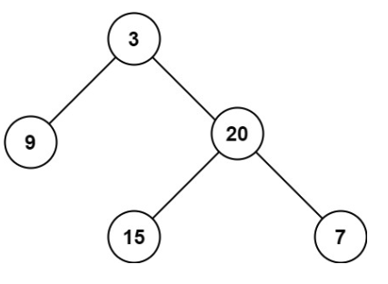

# 104. 二叉树的最大深度 <Badge type="tip" text="Easy" />

给定一个二叉树 `root` ，返回其最大深度。

二叉树的 最大深度 是指从根节点到最远叶子节点的最长路径上的节点数。



>示例 1:  
输入：root = [3,9,20,null,null,15,7]  
输出：3

>示例 2:  
输入：root = [1,null,2]  
输出：2

## 解题思路

输入： 一个二叉树的根节点 root。

输出： 返回最大深度

本题属于**自底向上 DFS（后序遍历）**问题。

我们使用递归来计算每个节点的最大深度，其核心逻辑是：

* 对于每个节点，它的最大深度 = `max(左子树深度, 右子树深度) + 1`
* 空节点返回深度 0（递归终止条件）
* 从叶子节点开始逐层向上返回深度，最终在根节点返回整棵树的最大深度

这是一种 后序遍历（left → right → root） 的过程，递归地先处理子树，再汇总结果，最终得到整棵树的最大深度。

## 代码实现

::: code-group

```python
class Solution:
    def maxDepth(self, root: Optional[TreeNode]) -> int:
        # 如果当前节点为空，说明这是一棵空树，深度为 0
        if not root:
            return 0

        # 否则，递归计算左右子树的最大深度，并取其中较大值加 1（当前节点本身）
        return 1 + max(self.maxDepth(root.left), self.maxDepth(root.right))
```

```javascript
const maxDepth = function(root) {
    // 如果当前节点为空，说明这是一棵空树，深度为 0
    if (!root) return 0;

    // 否则，递归计算左右子树的最大深度，并取其中较大值加 1（当前节点本身）
    return Math.max(maxDepth(root.left), maxDepth(root.right)) + 1;
};
```

:::

## 复杂度分析

时间复杂度：O(n)

空间复杂度：O(h)

## 链接

[104 国际版](https://leetcode.com/problems/maximum-depth-of-binary-tree/)

[104 中文版](https://leetcode.cn/problems/maximum-depth-of-binary-tree/)
