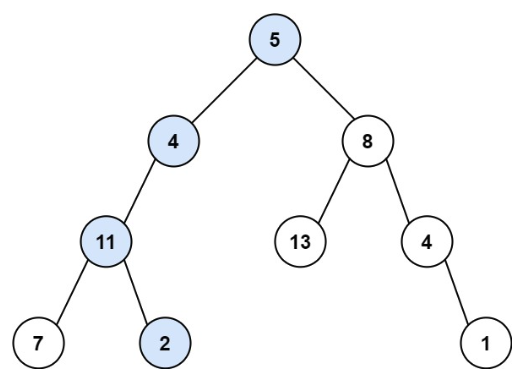

# 112. 路径总和 <Badge type="tip" text="Easy" />

给你二叉树的根节点 `root` 和一个表示目标和的整数 `targetSum` 。判断该树中是否存在 根节点到叶子节点 的路径，这条路径上所有节点值相加等于目标和 targetSum 。如果存在，返回 true ；否则，返回 false 。

叶子节点 是指没有子节点的节点。



>示例 1:  
输入：root = [5,4,8,11,null,13,4,7,2,null,null,null,1], targetSum = 22  
输出：true  
解释：等于目标和的根节点到叶节点路径如上图所示。


>示例 2:  
输入：root = [1,2,3], targetSum = 5  
输出：false  
解释：树中存在两条根节点到叶子节点的路径：  
(1 --> 2): 和为 3  
(1 --> 3): 和为 4  
不存在 sum = 5 的根节点到叶子节点的路径。

## 解题思路

输入： 一个二叉树的根节点 root，以及一个整数 targetSum，表示目标路径和。

输出： 判断是否存在一条从根节点到叶子节点的路径，使得沿途节点值之和恰好等于 targetSum。

本题属于**自顶向下 DFS + 减法累加**问题。

我们可以使用递归函数 `dfs` 来遍历树的每一条路径。在递归过程中，每访问一个节点，就将该节点的值从 `targetSum` 中减去。
当到达叶子节点时，如果此时剩余的 `targetSum` 恰好等于该叶子的值，说明存在一条满足条件的路径。

本质上，这道题的关键在于：递归过程中将目标值逐步“消耗”，判断是否能恰好减为 0。

## 代码实现

::: code-group

```python
class Solution:
    def hasPathSum(self, root: Optional[TreeNode], targetSum: int) -> bool:
        # 如果当前节点为空，直接返回 False
        if not root:
            return False

        # 如果当前节点是叶子节点，检查路径和是否刚好等于 targetSum
        if not root.left and not root.right:
            return root.val == targetSum

        # 否则，递归检查左右子树，更新目标值为 targetSum - 当前节点值
        new_target = targetSum - root.val

        return (
            self.hasPathSum(root.left, new_target) or
            self.hasPathSum(root.right, new_target)
        )
```

```javascript
var hasPathSum = function(root, targetSum) {
    // 如果当前节点为空，直接返回 False
    if (!root) return false;

    // 如果当前节点是叶子节点，检查路径和是否刚好等于 targetSum
    if (!root.left && !root.right) {
        return root.val == targetSum;
    }

    // 否则，递归检查左右子树，更新目标值为 targetSum - 当前节点值
    targetSum -= root.val;

    return hasPathSum(root.left, targetSum) || hasPathSum(root.right, targetSum)
};
```

:::

## 复杂度分析

时间复杂度：O(n)

空间复杂度：O(n)

## 链接

[112 国际版](https://leetcode.com/problems/path-sum/description/)

[112 中文版](https://leetcode.cn/problems/path-sum/description/)
