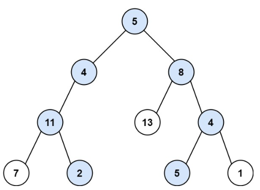

# 113. 路径总和 II <Badge type="warning" text="Medium" />

给你二叉树的根节点 `root` 和一个整数目标和 `targetSum` ，找出所有 从根节点到叶子节点 路径总和等于给定目标和的路径。

叶子节点 是指没有子节点的节点。



>示例 1:  
输入：root = [5,4,8,11,null,13,4,7,2,null,null,5,1], targetSum = 22  
输出：[[5,4,11,2],[5,8,4,5]]


>示例 2:  
输入：root = [1,2,3], targetSum = 5  
输出：[]

>示例 3:  
输入：root = [1,2], targetSum = 0  
输出：[]

## 解题思路

输入： 一个二叉树的根节点 `root`，以及一个整数 `targetSum`，表示目标路径和。

输出： 找出所有从根节点到叶子节点的路径，使得沿途节点值之和恰好等于 `targetSum`。

本题属于**自顶向下 DFS + 路径记录 + 回溯**问题。

我们通过深度优先搜索（DFS）遍历所有从根到叶子的路径，同时在遍历过程中：

* 每次将当前节点值加入路径 `path`；
* 并将其从 `targetSum` 中减去，表示“已消耗目标值”；
* 如果当前是叶子节点，且剩余目标值正好等于该节点值，说明找到一条合法路径，记录下路径副本；
* 每次递归返回后，要将当前节点从路径中移除 `path.pop()`，进行回溯，以便探索其他路径。


## 代码实现

::: code-group

```python
class Solution:
    def pathSum(self, root: Optional[TreeNode], targetSum: int) -> List[List[int]]:
        res = []  # 用于存储所有符合条件的路径

        def dfs(node: Optional[TreeNode], remaining: int, path: List[int]):
            if not node:
                return  # 到达空节点，返回

            # 将当前节点加入路径
            path.append(node.val)

            # 如果是叶子节点，且路径和正好等于目标值
            if not node.left and not node.right:
                if node.val == remaining:
                    # 注意要添加 path 的副本，否则后续修改会影响结果
                    res.append(list(path))

            # 继续向左、右子树搜索，目标值减去当前节点的值
            dfs(node.left, remaining - node.val, path)
            dfs(node.right, remaining - node.val, path)

            # 回溯：撤销本层递归对 path 的修改
            path.pop()

        # 从根节点开始 DFS，初始路径为空
        dfs(root, targetSum, [])

        return res
```

```javascript
var pathSum = function(root, targetSum) {
    // 用于存储所有符合条件的路径
    const res = [];

    function dfs(node, targetSum, path) {
        // 到达空节点，返回
        if (!node) return;

        // 将当前节点加入路径
        path.push(node.val)

        if (!node.left && !node.right && targetSum == node.val)
            // 注意要添加 path 的副本，否则后续修改会影响结果
            res.push([...path]);
        
        // 继续向左、右子树搜索，目标值减去当前节点的值
        dfs(node.left, targetSum - node.val, path)
        dfs(node.right, targetSum - node.val, path)

        path.pop()
    }

    // 从根节点开始 DFS，初始路径为空
    dfs(root, targetSum, [])
    
    return res;
};
```

:::

## 复杂度分析

时间复杂度：O(n)

空间复杂度：O(n)

## 链接

[113 国际版](https://leetcode.com/problems/path-sum-ii/description/)

[113 中文版](https://leetcode.cn/problems/path-sum-ii/description/)
