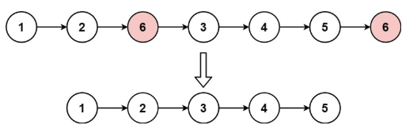

# 203. 移除链表元素 <Badge type="tip" text="Easy" />

给你一个链表的头节点 head 和一个整数 val ，请你删除链表中所有满足 Node.val == val 的节点，并返回 新的头节点 。



>示例 1:  
输入：head = [1,2,6,3,4,5,6], val = 6  
输出：[1,2,3,4,5]

>示例 2:  
输入：head = [], val = 1  
输出：[]

>示例 3:  
输入：head = [7,7,7,7], val = 7  
输出：[]

## 解题思路
**输入：** 一个链表 `head`，一个整数 `val`

**输出：** 删除链表中所有值等于 `val` 的节点，并返回新的头节点

本题属于**链表删除类**问题。关键在于处理删除节点，尤其是头节点也可能被删除的情况。

为简化操作，我们引入一个**哨兵节点 `dummy`**，并令其指向原链表头部（`dummy.next = head`）。这样，无论头节点是否被删除，操作逻辑都能统一处理，无需特殊判断。

接着使用两个指针：

* `curr` 指向当前遍历的节点（从 `head` 开始）；
* `prev` 指向 `curr` 的前一个节点（初始为 `dummy`）。

遍历过程中：

* 若 `curr.val == val`，则将 `prev.next` 指向 `curr.next`，从链表中跳过该节点；
* 否则，说明当前节点保留，更新 `prev = curr`；
* 无论如何，`curr` 每轮都向前推进。

最终返回 `dummy.next` 作为新链表头，因为原 `head` 有可能被删除。

## 代码实现

::: code-group

```python
class Solution:
    def removeElements(self, head: Optional[ListNode], val: int) -> Optional[ListNode]:
        # 创建一个哨兵节点 dummy，next 指向原始链表头部
        dummy = ListNode(next=head)

        # prev 是当前节点的前一个节点，curr 是当前遍历的节点
        prev = dummy
        curr = head

        # 遍历整个链表
        while curr:
            if curr.val == val:
                # 当前节点值等于目标值，删除：prev 跳过 curr
                prev.next = curr.next
            else:
                # 否则保留当前节点，prev 向前移动
                prev = curr

            # curr 始终向前推进
            curr = curr.next

        # 返回去掉目标值节点后的链表头部（dummy 的下一个节点）
        return dummy.next
```

```javascript
const removeElements = function(head, val) {
    // 创建一个哨兵节点 dummy，next 指向原始链表头部
    const dummy = new ListNode(null, head);

    // prev 是当前节点的前一个节点，curr 是当前遍历的节点
    let prev = dummy;
    let curr = head;

    // 遍历整个链表
    while (curr != null) {
        if (curr.val == val) {
            // 当前节点值等于目标值，删除：prev 跳过 curr
            prev.next = curr.next;
        } else {
            // 否则保留当前节点，prev 向前移动
            prev = curr;
        }

        // curr 始终向前推进
        curr = curr.next;
    }

    // 返回去掉目标值节点后的链表头部（dummy 的下一个节点）
    return dummy.next;
};
```

:::

## 复杂度分析

时间复杂度：O(n)

空间复杂度：O(1)

## 链接

[203 国际版](https://leetcode.com/problems/remove-linked-list-elements/description/)

[203 中文版](https://leetcode.cn/problems/remove-linked-list-elements/description/)
