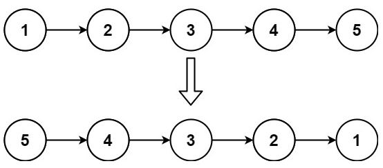

# 206. 反转链表 <Badge type="tip" text="Easy" />

给你单链表的头节点 head ，请你反转链表，并返回反转后的链表。



>示例 1:  
输入：head = [1,2,3,4,5]
输出：[5,4,3,2,1]

>示例 2:  
输入：head = [1,2]
输出：[2,1]

>示例 3:  
输入：head = []
输出：[]

## 解题思路

**输入：** 一个链表 `head`

**输出：** 返回反转后的链表

本题属于**链表反转类**问题，核心是逐个节点地修改指针方向。

**处理流程如下：**

1. **特殊情况处理：**
   若链表为空或仅有一个节点，直接返回 `head`，无需反转。

2. **初始化两个指针：**

   * `prev`：表示反转后链表的前一个节点，初始为 `None`；
   * `curr`：表示当前正在处理的节点，初始为 `head`。

3. **遍历并反转链表：**
   在遍历过程中，每次执行以下三步：

   * 保存下一个节点：`nxt = curr.next`
   * 修改当前节点指向前一个节点：`curr.next = prev`
   * 指针整体向前推进：`prev = curr`, `curr = nxt`

4. **返回反转后的链表头：**
   遍历结束后，`curr` 为 `None`，而 `prev` 指向新的头节点，返回 `prev` 即可。

## 代码实现

::: code-group

```python
class Solution:
    def reverseList(self, head: Optional[ListNode]) -> Optional[ListNode]:
        # 如果链表为空或只有一个节点，直接返回
        if not head or not head.next:
            return head

        # 初始化两个指针：prev 指向已反转部分的头，curr 指向当前节点
        prev = None
        curr = head

        # 遍历链表
        while curr:
            nxt = curr.next     # 保存下一个节点
            curr.next = prev    # 当前节点反转指向前一个节点
            prev = curr         # prev 前进到当前节点
            curr = nxt          # curr 前进到下一个节点

        # 最终 prev 指向反转后的新头节点
        return prev
```

```javascript
const reverseList = function(head) {
    // 如果链表为空或只有一个节点，直接返回
    if (!head || !head.next) return head;

    // 初始化两个指针：prev 指向已反转部分的头，curr 指向当前节点
    let prev = null;
    let curr = head;

    // 遍历链表
    while (curr != null) {
        // 保存下一个节点
        const nxt = curr.next;
        // 当前节点反转指向前一个节点
        curr.next = prev;
        // prev 前进到当前节点
        prev = curr;
        // curr 前进到下一个节点
        curr = nxt;
    }

    // 最终 prev 指向反转后的新头节点
    return prev;
};
```

:::

## 复杂度分析

时间复杂度：O(n)

空间复杂度：O(1)

## 链接

[206 国际版](https://leetcode.com/problems/reverse-linked-list/description/)

[206 中文版](https://leetcode.cn/problems/reverse-linked-list/description/)
