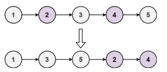
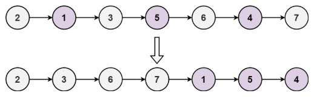

# 328. 奇偶链表

给定单链表的头节点 head ，将所有索引为奇数的节点和索引为偶数的节点分别组合在一起，然后返回重新排序的列表。

第一个节点的索引被认为是 奇数 ， 第二个节点的索引为 偶数 ，以此类推。

请注意，偶数组和奇数组内部的相对顺序应该与输入时保持一致。

你必须在 O(1) 的额外空间复杂度和 O(n) 的时间复杂度下解决这个问题。




>示例 1:  
输入: head = [1,2,3,4,5]
输出: [1,3,5,2,4]



>示例 2:  
输入: head = [2,1,3,5,6,4,7]
输出: [2,3,6,7,1,5,4]

## 解题思路
**输入：** 一个链表 `head`

**输出：** 将链表中**奇数索引节点排在前面，偶数索引节点排在后面**，保持相对顺序不变

本题属于**链表插入与重排类**问题，目标是将原链表重新组织为“奇数位节点 + 偶数位节点”的组合。

**处理流程如下：**

1. **特殊情况处理：**
   若链表为空，或只有一个节点，直接返回原链表。

2. **初始化三个指针：**

   * `odd` 指向当前奇数位节点（初始化为 `head`）；
   * `even` 指向当前偶数位节点（初始化为 `head.next`）；
   * `even_head` 保存偶数链表的头部（后续用于拼接）。

3. **交叉重排链表：**
   从偶数节点开始遍历，直到遍历结束（`even` 或 `even.next` 为 null）：

   * 令 `odd.next = even.next`，跳过当前偶数节点，连接到下一个奇数节点；
   * 将 `odd` 前移到新的奇数节点；
   * 再令 `even.next = odd.next`，跳过当前奇数节点，连接到下一个偶数节点；
   * 将 `even` 前移到新的偶数节点。

4. **拼接两个子链表：**
   处理完所有节点后，将奇数链表尾部连接上偶数链表头部，即 `odd.next = even_head`。

5. **返回结果链表头部：**
   最终返回原始的 `head`，此时它已指向正确排列后的链表。

## 代码实现

::: code-group

```python
class Solution:
    def oddEvenList(self, head: Optional[ListNode]) -> Optional[ListNode]:
        # 如果链表为空或只有一个节点，直接返回
        if not head:
            return head

        # odd 指针初始化为第一个节点（奇数位置）
        odd = head
        # even_head 是偶数头节点，用于后面连接
        even_head = head.next
        # even 指针初始化为第二个节点（偶数位置）
        even = even_head

        # 循环条件：偶数节点和它的下一个节点都存在
        while even and even.next:
            # 将 odd 的 next 指向下一个奇数节点
            odd.next = even.next
            odd = odd.next  # odd 向前移动一位

            # 将 even 的 next 指向下一个偶数节点
            even.next = odd.next
            even = even.next  # even 向前移动一位

        # 将奇数链表尾部连接上偶数链表头部
        odd.next = even_head

        # 返回重新排列后的链表头
        return head
```

```javascript
const oddEvenList = function(head) {
    // 如果链表为空或只有一个节点，直接返回
    if (!head) return head;

    // odd 指针初始化为第一个节点（奇数位置）
    odd = head;
    // even_head 是偶数头节点，用于后面连接
    even_head = head.next;
    // even 指针初始化为第二个节点（偶数位置）
    even = even_head;

    // 循环条件：偶数节点和它的下一个节点都存在
    while (even && even.next) {
        // 将 odd 的 next 指向下一个奇数节点
        odd.next = even.next;
        // odd 向前移动一位
        odd = odd.next;

        // 将 even 的 next 指向下一个偶数节点
        even.next = odd.next;
        // even 向前移动一位
        even = even.next;
    }

    // 将奇数链表尾部连接上偶数链表头部
    odd.next = even_head;

    // 返回重新排列后的链表头
    return head;
};
```

:::

## 复杂度分析

时间复杂度：O(n)

空间复杂度：O(1)

## 链接

[328 国际版](https://leetcode.com/problems/odd-even-linked-list/description/)

[328 中文版](https://leetcode.cn/problems/odd-even-linked-list/description/)
